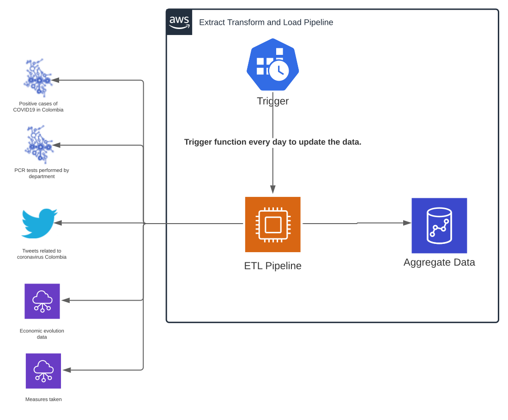

Table of contents
=================
   * [Context](#context)
   * [Approach](#approach)
   * [Data sources](#data-sources)
      * [APIs](#apis)
      * [Web Scrapping](#web-scrapping)
      * [Twitter](#twitter)
   * [Resources](#resources)
      * [EC2 Instance](#ec2-instance)
      * [Data Lake](#data-lake)
   * [Architecture](#architecture)
   * [Project structure](#project-structure)
   * [Phases](#phases)
     * [ETL](#etl)
     * [EDA](#eda)
   * [Deploy](#deploy)
   * [Appendix](#appendix)
      * [Estimate Cloud Costs](#estimate-cloud-costs)
      * [Estimate Time Costs](#estimate-time-costs)

Context
=================

In the present days, the pandemic, social changes and economic upheavals need a different approach in their analysis and understanding of how this affected beyond the health of the population. It is important to note that some of these changes and the situation itself have led the media, politicians and influencers to make statements and actions that may affect the development of the pandemic, increasing or decreasing the curve, bi-directionally affecting the behavior of the curve itself.

Approach
=================

The main idea behind the analisys of the curve and the social and economic changes is to understand how the pandemic brought afloat of certain problems and some culture artifacts in Colombia. I try to understand the behavior keeping in mind some useful variables and data like, data from Colombia Goverment about daily positive cases and number of test do it, this to have and idea of the reality of the pandemic growing, but those variables have shadow data that can affect the behavior of the curve which are the social and media information that circulate in social networks like Twitter, this unstructured data will be brought from Twitter API and analyzed to understand the sentiments and thoughts of general population. The complete analisys center in understand the sentiments and ideas of the people and actions taken by the goverment and finalcial institutes to see the evolution of the curve. Taken the data from different sources enrich the understanding of the real behavior and can lead me to predict the behavior in near future and of course analysis the effectiveness of the actions taken by state control agencies.

I want to answer, Are the state control agencies and politicians statements affecting positive or negative the growing of the curve? and How did the actions and policies taken by the state affect the evolution of COVID 19 affect departments in lower states of quality of life?

Data sources
=================

<strong>Note: Data for positive daily cases must be right shifted to be consistent with the fact that the test is generally only used for people showing symptoms and takes an average of 5-6 days, however it can take up to 14 days. ([WHO, 2020](https://www.who.int/health-topics/coronavirus#tab=tab_3))</strong>

The data will be collected from different sources, all the collected data will be passed through a processing and aggregation ETL to finally end up in a data lake in Amazon RedShift

APIs
-----

The data of COVID cases and test done daily will be extracted from [www.datos.gov.co](www.datos.gov.co) specifically:

* [Casos positivos de COVID-19 en Colombia](https://www.datos.gov.co/Salud-y-Protecci-n-Social/Casos-positivos-de-COVID-19-en-Colombia/gt2j-8ykr)
* [Pruebas PCR procesadas de COVID-19 en Colombia (Departamental)](https://www.datos.gov.co/Salud-y-Protecci-n-Social/Pruebas-PCR-procesadas-de-COVID-19-en-Colombia-Dep/8835-5baf)

I used this api to load and download update data from last valid day.

Web Scrapping
-----

To obtain the latest political and economic news, the data will be collected through web scrapping of the main Colombian newspapers, specifically:

* [El Tiempo](https://www.eltiempo.com/)

Other information necessary to obtain more knowledge about the current state of Colombia and its economy. I need to collect data on unemployment and inflation trends.

* Unemployment rate by [DANE](https://www.dane.gov.co/index.php/estadisticas-por-tema/mercado-laboral/empleo-y-desempleo#geih-mercado-laboral)
* Inflation and dollar exchange by [Catálogo de estadísticas Banco de la Republica](https://www.banrep.gov.co/es/catalogo-estadisticas)

Twitter
-----

To get real time data to use to sentiment analisys and make and average of the population mood I used Twitter API to search tweet related to COVID19 issue in Colombia, using the lookup tweet endpoint and filtered stream feature. To use Twitter API follow [the guide](https://developer.twitter.com/en/docs/twitter-api/getting-started/guide)

Resources
=================

EC2 Instance
-----

To deploy the ETL process to recolect data from different sources for later use in EDA process, we need to run the code each day, to update with last data from the used sources. For that I proposed to deploy the code in EC2 instance that can be trigger with cron job in aws cloudwatch to start the ETL process. You can see the pricing [here](https://aws.amazon.com/es/ec2/pricing/on-demand/), to lowest cost in this project I propose to use a on demand machine specifically a1.xlarge with an hour cost of $ 0.102

Data Lake
-----

And important thing when we are working in Big Data and EDA process is the storage where we save our data. For that I propose to use AWS RedShift to store data in production, this for its flexibility, lowest cost and easy use with Standard SQL. You can see the pricing [here](https://aws.amazon.com/es/redshift/pricing/). Taking into account that the amount of data using in this project with the limitations of twitter api and web scrapping, I propose to use dc2.large machine wiht an hour cost of $ 0.25.

Architecture
=================

The cloud architecture to deploy the ETL process to collect and ingest data in the RedShift data lake will be simple because only has and EC2 instance that trigger by a cron job a python script that will be resposible for extract, transform and load the data in Redshift. The aggregate data will be used in the Exploratory Data Analysis (EDA)

Project Structure
=================

* eda/ -> folder containing all data analysis
* etl/ -> folder containing all data extraction and transformation
  * configs/ -> containing configs for extracting the data from APIs and web scrapping
    * gov_api.yaml
    * twitter_api.yaml
    * web_scrapping.yaml
  * database/ -> SQL files to create the mineable views and load script (Postgres and RedShift).
    * create_postgres.sql
    * create_redshift.sql
    * load_postgres.sql
    * load_redshift.sql
  * extractors/ -> containing folder of all modules and classes to scrap and bring data from APIs or web pages
    * data/ -> local data downloaded from DANE and Banco de la Republica
      * employe.xlsx
      * inflation.xlsx
    * utils/ -> classes to abstract the web scrapping behavior
      * news_feed.py
      * news_page.py
    * config.py
    * gov_extract.py -> module in charge of loading data from datos.gov.co
    * local_extract.py -> module in charge of loading local data
    * twitter_extract.py -> module in charge of bring data from Twitter API
    * web_scrapping.py -> module in charge of web scrap "El Tiempo"
  * requirements.txt
  * run.ipynb -> JP notebook containing the detailed ETL process
  * output/ -> output folder of data csv files

Phases
=================

ETL
-----

The ETL processes was made using techniques as web scrapping and using open and private APIs abstracting certain behavior in modules and classes, making it an easy process to modify and improve in near future. The complete and documentated process is [here](./etl/run.ipynb)

EDA
-----

The EDA process was made using libraries and querying the data loaded to mineable views in ETL process, to see the complete and documented process you can see [here](./eda/run.ipynb)

Deploy
=================

Appendix
=================

Estimate Cloud Costs
-----

Estimate Time Costs
-----